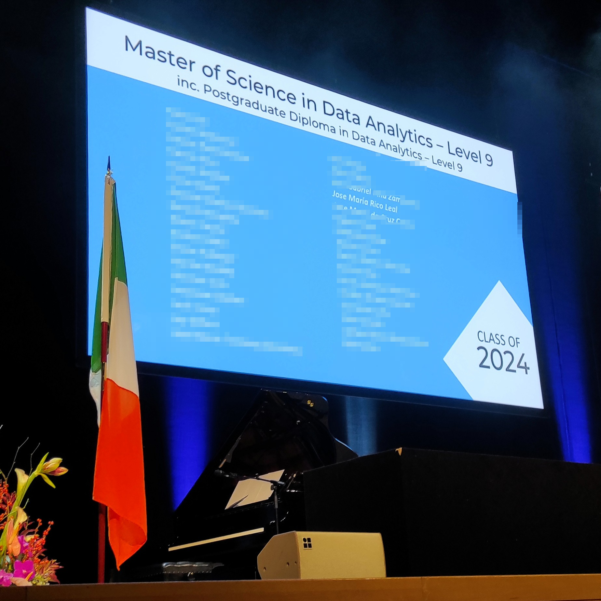

# MSc in Data Analytics GitHub Account 🖥️ 

## CCT College Dublin, Ireland 🎓 
Welcome to the **MSc Data Analytics GitHub repository**, dedicated exclusively to showcasing the projects, code, and materials I have used and developed during my Master of Science in Data Analytics at **CCT College Dublin**. The program commenced in September 2023 and concluded in October 2024. This repository highlights my academic journey, the technical skills gained, and the applied research undertaken throughout the program.

## About the Program 📘
The MSc in Data Analytics at **CCT College Dublin** is a structured program designed to equip graduates with advanced tools, techniques, and methodologies to analyze, interpret, and visualize data effectively. The program spans three semesters:  

- **Semester 1:** Focused on foundational subjects to build core competencies in machine learning, data preparation, statistics, and programming.  
- **Semester 2:** Advanced subjects explored big data storage, processing, and data analysis, along with research and professional ethics.  
- **Semester 3:** Dedicated entirely to a capstone project titled *"Federated Learning: Evaluating Popular Frameworks and Developing a Cross-Client Horizontal Server."* This project focused on bridging the gap between academic Federated Learning (FL) frameworks and real-world FL systems. The research involved building a horizontal FL server for binary classification and image classification tasks, demonstrating improvements in accuracy for non-IID data scenarios while highlighting challenges such as communication issues and infrastructure limitations.

### Modules & Grades 📝
| **Module**                                | **Credits** | **Grade (%)** | **Result** |
|-------------------------------------------|-------------|---------------|------------|
| **Semester 1**                            |             |               |            |
| Machine Learning for Data Analytics       | 10          | 68            | Pass       |
| Data Preparation & Visualisation          | 10          | 64            | Pass       |
| Statistics for Data Analysis              | 10          | 67            | Pass       |
| Programming for Data Analytics            | 5           | 63            | Pass       |
| **Semester 2**                            |             |               |            |
| Research & Professional Ethics            | 5           | 57            | Pass       |
| Advanced Data Analysis                    | 10          | 75            | Pass       |
| Big Data Storage & Processing             | 10          | 78            | Pass       |
| **Semester 3**                            |             |               |            |
| Data Analytics Project                    | 30          | 50            | Pass       |

## Results Summary 🏆
- **Cohort:** PG24480 - MSc in Data Analytics (L9)  
- **Completion:** October 2024
- **Award Classification:** Second-class Honours  
- **Percentage Point Average (PPA):** 62.44  

##  Key Highlights ✨
This repository includes code and documentation from the following projects:  
- **Machine Learning for Data Analytics:** Implementation of Random Forest, K-Nearest Neighbors, and Neural Networks on various datasets.  
- **Data Preparation & Visualisation:** Data cleaning and exploratory data analysis (EDA) using Python libraries such as `pandas` and `seaborn`.  
- **Big Data Storage & Processing:** Projects on distributed data processing using Hadoop, Spark, and MapReduce.  
- **Capstone Project:** A research-driven exploration of Federated Learning for secure and decentralized machine learning.

## Skills Demonstrated 🛠️ 
- **Programming:** Python, R, SQL  
- **Machine Learning Techniques:** Decision Trees, Neural Networks, CNNs  
- **Big Data Ecosystem:** Hadoop, Spark, MongoDB, Hive  
- **Statistics & Analysis:** ANOVA, Hypothesis Testing, Chi-Square  
- **Visualization:** matplotlib, seaborn, Tableau  

##  Graduation Ceremony 🎓
The last day of this beautiful journey was the graduation ceremony held on the **23rd of November 2024** at the **Convention Centre Dublin (CCD)** in Dublin, Ireland. This event marked the culmination of hard work, dedication, and countless learning experiences throughout my MSc program.  

  

## Archive Notice 📂

This GitHub account serves as an **archive** for the projects, code, and materials created during my MSc in Data Analytics at **CCT College Dublin**.  

Please note that this account is no longer actively updated.  

To explore my ongoing projects and stay up-to-date with my work, visit my personal GitHub account: [@josericodata](https://github.com/josericodata).

## Connect with Me 🌐
Feel free to explore my work and connect:  

  
  
  
  

## You are visitor 

  

